<div align="center">



# geomotion

**Hand-drawn motion, from simple shapes.**

Describe a few poses as circles, lines and paths — geomotion morphs between them and re-inks
every frame by hand: wobbly tapered strokes, boiling lines, riso-offset fills.<br/>
Export **animated SVG**, **Lottie**, **HTML**, or just **share a link**.

[**Website**](https://hacimertgokhan.github.io/geomotion) ·
[**Studio**](https://hacimertgokhan.github.io/geomotion/studio/) ·
[Gallery](https://hacimertgokhan.github.io/geomotion/#gallery) ·
[Claude / MCP](#-claude-mcp-server--skill) ·
[Spec reference](#-the-spec)


</div>

---

## ✦ Why

Most animation tools make you draw every frame or fiddle with a timeline. geomotion goes the other way:
you write **poses**, it does the in-betweens — and it draws them like a person would, so the result has
the warmth of traced cel animation instead of the stiffness of vector tweening.

- **Boiling ink** — every few frames the line is redrawn with a fresh wobble and tapered ends.
- **Smart morphing** — shapes are resampled and aligned automatically; circles become stars, lines curl into loops, dots become hearts.
- **Riso fills** — soft fills sit slightly off the ink, like a two-colour print. Warm paper palette built in.
- **Transparent or not** — every export comes with or without a background.
- **Links, not uploads** — the whole animation is compressed into the URL. Share it, embed it, edit it.
- **Claude-ready** — MCP server + skill, so Claude can design, render and share animations from a sentence.
- **Zero dependencies** — plain ES modules for the browser and Node. Deterministic: same spec → same drawing.

<div align="center">

</div>

## ✦ Quick start

**No install — use the browser.** Open the [studio](https://hacimertgokhan.github.io/geomotion/studio/),
pick one of 31 presets, edit the JSON, press **Share link** or download **SVG / Lottie / PNG**.

**Command line** (Node 18+):

```bash
npx -y github:hacimertgokhan/geomotion list                      # presets by category
npx -y github:hacimertgokhan/geomotion render sunrise --both      # svg + lottie, with & without background
npx -y github:hacimertgokhan/geomotion render my-spec.json --formats svg,lottie,html,poster --out public/anim
npx -y github:hacimertgokhan/geomotion presets --category interface --transparent
npx -y github:hacimertgokhan/geomotion link my-spec.json         # player / studio / embed links
```

**Locally:**

```bash
git clone https://github.com/hacimertgokhan/geomotion && cd geomotion
npm run dev          # site + studio at http://localhost:5199
npm test
```

## ✦ Use it on a website

```html
<script type="module" src="https://hacimertgokhan.github.io/geomotion/src/embed.js"></script>

<geo-motion preset="success" transparent style="width:160px"></geo-motion>
<geo-motion src="./my-animation.json"></geo-motion>
<geo-motion code="z…"></geo-motion>                  <!-- the #s=… part of a share link -->
<geo-motion preset="bell" hover></geo-motion>        <!-- plays only on hover -->
```

Attributes: `preset` · `src` · `code` · `transparent` · `paused` · `hover` · `speed` · `start`.
It renders to a canvas, compiles each spec once per page and pauses when off-screen.

Or link/iframe a player:

| Link | What it does |
| --- | --- |
| `…/geomotion/play/#preset=sunrise` | full-screen player |
| `…/geomotion/play/#preset=success&bg=0` | transparent background |
| `…/geomotion/play/#s=<code>` | any custom animation (from **Share link**) |
| `…/geomotion/studio/#s=<code>` | open it for editing |

## ✦ Claude (MCP server + skill)

**Claude Code plugin** — MCP tools and the skill in one go:

```
/plugin marketplace add hacimertgokhan/geomotion
/plugin install geomotion@geomotion
```

**Just the MCP server** (Claude Code, Claude Desktop, Cursor, any MCP client):

```bash
claude mcp add geomotion -- npx -y github:hacimertgokhan/geomotion mcp
```

```json
{
  "mcpServers": {
    "geomotion": { "command": "npx", "args": ["-y", "github:hacimertgokhan/geomotion", "mcp"] }
  }
}
```

| Tool | Purpose |
| --- | --- |
| `geomotion_guide` | spec reference, design tips and the preset catalog |
| `geomotion_list_presets` | presets by category |
| `geomotion_get_preset` | full JSON of a preset to start from |
| `geomotion_render` | write SVG / Lottie / HTML / poster files (+ transparent variants) and return share links |
| `geomotion_share_link` | encode a spec into player / studio / embed links, no files |
| `geomotion_validate` | check a spec, get precise errors |

Env: `GEOMOTION_OUT` (output folder), `GEOMOTION_SITE` (base URL for links).

**Skill** — [`skills/geomotion/SKILL.md`](skills/geomotion/SKILL.md) teaches Claude the spec and the design rules.
It also works without Node: `python skills/geomotion/scripts/link.py spec.json` turns a spec into a share link.
Upload the `skills/geomotion` folder on claude.ai (Settings → Capabilities → Skills) to use it there.

Then just ask: *“Make a transparent loader where a paper plane turns into a check mark.”*

## ✦ The spec

An animation is a list of **keyframes** (poses); each pose is a list of **shapes**. Shapes with the same
`id` morph into each other. Coordinates are in canvas units (default 1200 × 1200).

```json
{
  "name": "day-to-night",
  "fps": 24, "boil": 12, "loop": true, "background": "ivory",
  "hold": 1, "duration": 1, "ease": "inOutCubic",
  "style": { "width": 24, "wobble": 1, "taper": 0.5, "misregister": [-14, 10] },
  "keyframes": [
    { "shapes": [ { "id": "orb", "type": "circle", "cx": 600, "cy": 600, "r": 240, "fill": "sun" } ] },
    { "shapes": [
      { "id": "orb", "type": "crescent", "cx": 560, "cy": 620, "r": 240, "thickness": 0.42, "angle": -40, "fill": "heather" },
      { "id": "star", "type": "star", "cx": 880, "cy": 320, "r": 52, "fill": "sun", "enter": "pop", "delay": 0.3 }
    ] }
  ]
}
```

<details>
<summary><b>Top-level fields</b></summary>

| Field | Default | |
| --- | --- | --- |
| `size` | `[1200, 1200]` | canvas size |
| `fps` | `24` | output frame rate |
| `boil` | `12` | line re-draws per second (`0` = still) |
| `loop` | `true` | last pose morphs back to the first |
| `background` | `"ivory"` | colour or `"transparent"` |
| `seed` | `1` | change for another hand-drawn variation |
| `hold` / `duration` / `ease` | `0.7` / `0.9` / `inOutCubic` | keyframe defaults |
| `style.width` | `24` | stroke width (scales with canvas) |
| `style.wobble` | `1` | 0 = clean vector · 1 = hand-drawn · 2 = shaky |
| `style.roughness` | `1` | width variation along the line |
| `style.taper` | `0.5` | thinner line ends |
| `style.misregister` | `[-14, 10]` | fill offset vs ink; `false` = off |

</details>

<details>
<summary><b>Shapes</b></summary>

| Type | Fields |
| --- | --- |
| `circle` | `cx, cy, r` |
| `ellipse` | `cx, cy, rx, ry` |
| `rect` | `x, y, w, h` or `cx, cy, w, h`, `radius?` |
| `line` | `from, to` or `points` |
| `polyline` / `polygon` | `points`, `closed?` |
| `regular` / `triangle` | `cx, cy, r, sides?, angle?` |
| `star` | `cx, cy, r, inner?, points?, angle?` |
| `heart` | `cx, cy, size` |
| `blob` | `cx, cy, r, seed?, irregularity?` |
| `crescent` | `cx, cy, r, thickness?, angle?` |
| `wave` | `from, to, amplitude?, waves?, phase?` |
| `spiral` | `cx, cy, r, turns?` |
| `arc` | `cx, cy, r, start, end` (degrees) |
| `path` | `d` — any SVG path; each subpath is its own line |

**Options on every shape:** `id`, `fill`, `stroke` (colour or `false`), `width`, `opacity`,
`enter` / `exit` (`grow` · `pop` · `draw` · `fade` · `cut`), `delay` (0–0.95, for staggering),
`ease`, `transform { translate, rotate, scale, origin }`, `misregister`.

</details>

<details>
<summary><b>Palette & easings</b></summary>

`ink` `slate` `ivory` `paper` `oat` `kraft` `clay` `coral` `fig` `sky` `cactus` `olive` `heather` `sun` `white` — or any hex.

`linear` `inQuad` `outQuad` `inOutQuad` `inCubic` `outCubic` `inOutCubic` `inOutQuart` `inSine` `outSine` `inOutSine`
`outExpo` `inOutExpo` `outBack` `inOutBack` `outElastic` `outBounce`

</details>

**Design tips:** 2–5 bold shapes per pose with ~120 px margin · ink outlines + one or two accent fills ·
tell a story through ids · stagger with `delay` · `draw` for written lines, `pop` for playful arrivals ·
split rotations larger than ~30° into several keyframes.

## ✦ Presets — 31 in 7 categories

| Category | Presets |
| --- | --- |
| Interface | `loader` `spinner` `success` `error` `toggle` `bell` `search` |
| Nature | `sunrise` `sprout` `rain` `night` `sea` |
| Communication | `chat` `send` `like` `connect` |
| Ideas & Business | `idea` `growth` `target` `gears` `house` |
| Characters | `smile` `ghost` `sparkle` |
| Abstract | `drift` `orbit` `kaleido` `pebbles` |
| Motion | `bounce` `pendulum` `jelly` |

## ✦ JavaScript API

```js
import { render, compile, toAnimatedSVG, toLottie, makeLinks } from 'geomotion';
import { PRESETS, CATEGORIES } from 'geomotion/presets';

const anim = render(spec, { transparent: true });
anim.svg;            // animated SVG string (SMIL — works in , browsers, GitHub READMEs)
anim.lottie;         // Lottie JSON (lottie-web, LottieFiles, iOS/Android)
anim.frameSVG(1.5);  // still frame at 1.5 s

const { player, studio, embed } = await makeLinks(spec);
```

## ✦ How it works

1. **Shapes → centerlines.** Every shape (or SVG path) becomes a polyline, resampled to 128 points.
2. **Matching.** Partners are found by `id`; closed loops are rotated/flipped to the alignment with the least travel, open lines can unroll into loops and back.
3. **Timeline.** Holds and morphs are laid out; each frame interpolates the centerlines with the chosen easing, per-shape delays and enter/exit modes.
4. **Ink.** Each centerline is offset into a filled outline with smooth noise (wobble), varying width and rounded, tapered caps. The noise seed changes `boil` times per second.
5. **Export.** Identical consecutive frames are merged, contours become compact Catmull-Rom Bézier paths, written out as SMIL-animated SVG or as one Lottie layer per drawing.

## ✦ Project layout

```
src/core/       engine (shapes, morphing, ink, SVG + Lottie renderers, links) — browser & Node
src/presets/    31 categorized presets
src/embed.js    <geo-motion> web component
src/node/       CLI, MCP server, local dev server
studio/         live editor        play/   link player        index.html + site/   website
skills/         Claude skill        .claude-plugin/   Claude Code plugin + marketplace
```

## ✦ Contributing

Issues and PRs are welcome — new presets especially. A preset is just a spec in `src/presets/<category>.js`;
run `npm test` and `npm run assets` before opening a PR.

## License

[MIT](LICENSE) © hacimertgokhan
