<p align="center">
  <a href="https://hacimertgokhan.github.io/geomotion">
    
  </a>
</p>

<p align="center">
  <a href="https://hacimertgokhan.github.io/geomotion"><b>Website</b></a>
  &nbsp;·&nbsp;
  <a href="https://hacimertgokhan.github.io/geomotion/studio/"><b>Studio</b></a>
  &nbsp;·&nbsp;
  <a href="#use-it-with-claude">Claude / MCP</a>
  &nbsp;·&nbsp;
  <a href="#the-spec">Spec</a>
  &nbsp;·&nbsp;
  <a href="#presets">Presets</a>
</p>

<p align="center">
  <a href="https://github.com/hacimertgokhan/geomotion/stargazers"></a>
  
  
  
</p>

<br />

**geomotion** turns a few poses — circles, lines, SVG paths — into animation that looks drawn by hand.
It morphs between the poses and re-inks every frame: tapered, wobbly strokes, lines that gently
"boil", and soft fills printed slightly off the ink. Export an animated **SVG**, a **Lottie** file,
an **HTML** page, or just **share a link**. No timeline, no dependencies.

<p align="center">
  
</p>

## Highlights

|  |  |
| --- | --- |
| **Boiling ink** | Lines are redrawn with a fresh wobble a dozen times a second, with tapered ends — like traced cel animation. |
| **Smart morphing** | Shapes are resampled and aligned automatically. Circles become stars, lines curl into loops, dots become hearts. |
| **Riso fills** | Fills sit slightly off the ink, like a two-colour print. A warm paper palette is built in. |
| **Every format** | Animated SVG (plays in ``), Lottie JSON, standalone HTML, PNG frames — each with or without a background. |
| **Links, not uploads** | The whole animation is compressed into the URL. Share it, embed it, open it in the studio to edit. |
| **Claude-ready** | MCP server, skill and Claude Code plugin — ask for an animation in a sentence. |
| **Zero dependencies** | Plain ES modules for browser and Node. Deterministic: the same spec always draws the same way. |

## Quick start

**In the browser — nothing to install.**
Open the [studio](https://hacimertgokhan.github.io/geomotion/studio/), pick one of 31 presets, edit the JSON,
then press **Share link** or download **SVG / Lottie / PNG**.

**From the command line** (Node 18+):

```bash
npx -y github:hacimertgokhan/geomotion list                    # presets by category
npx -y github:hacimertgokhan/geomotion render sunrise --both    # SVG + Lottie, with and without background
npx -y github:hacimertgokhan/geomotion render spec.json --formats svg,lottie,html,poster --out public/anim
npx -y github:hacimertgokhan/geomotion link spec.json           # player, studio and embed links
```

**From source:**

```bash
git clone https://github.com/hacimertgokhan/geomotion
cd geomotion
npm run dev        # website + studio on http://localhost:5199
npm test
```

## Use it on a website

```html
<script type="module" src="https://hacimertgokhan.github.io/geomotion/src/embed.js"></script>

<geo-motion preset="success" transparent style="width: 160px"></geo-motion>
<geo-motion src="./my-animation.json"></geo-motion>
<geo-motion code="z…"></geo-motion>             <!-- the #s=… part of a share link -->
<geo-motion preset="bell" hover></geo-motion>   <!-- plays on hover -->
```

`<geo-motion>` renders to a canvas, compiles each spec once per page and pauses while off-screen.
Attributes: `preset`, `src`, `code`, `transparent`, `paused`, `hover`, `speed`, `start`.

Prefer a link or an iframe? Every animation has one:

| URL | |
| --- | --- |
| `/geomotion/play/#preset=sunrise` | full-screen player |
| `/geomotion/play/#preset=success&bg=0` | transparent background |
| `/geomotion/play/#s=<code>` | any custom animation (from **Share link**) |
| `/geomotion/studio/#s=<code>` | open it for editing |

## Use it with Claude

Install the **Claude Code plugin** — MCP server and skill in one step:

```
/plugin marketplace add hacimertgokhan/geomotion
/plugin install geomotion@geomotion
```

Or add **only the MCP server** to Claude Code, Claude Desktop, Cursor or any MCP client:

```bash
claude mcp add geomotion -- npx -y github:hacimertgokhan/geomotion mcp
```

```json
{
  "mcpServers": {
    "geomotion": { "command": "npx", "args": ["-y", "github:hacimertgokhan/geomotion", "mcp"] }
  }
}
```

| Tool | What it does |
| --- | --- |
| `geomotion_guide` | Spec reference, design rules and the preset catalog |
| `geomotion_list_presets` | Presets grouped by category |
| `geomotion_get_preset` | Full JSON of a preset, to start from |
| `geomotion_render` | Writes SVG / Lottie / HTML / poster files (optionally transparent) and returns share links |
| `geomotion_share_link` | Encodes a spec into player, studio and embed links — no files |
| `geomotion_validate` | Checks a spec and explains what is wrong |

Environment: `GEOMOTION_OUT` (output folder), `GEOMOTION_SITE` (base URL for links).

The **skill** lives in [`skills/geomotion`](skills/geomotion/SKILL.md). It also works without Node —
`python skills/geomotion/scripts/link.py spec.json` turns a spec into a share link — so you can upload
the folder to claude.ai under *Settings → Capabilities → Skills*.

Then just ask: *"Make a transparent loader where a paper plane turns into a check mark."*

## The spec

An animation is a list of **keyframes** (poses). Each pose is a list of **shapes**.
Shapes that share an `id` morph into each other; everything else enters or leaves.
Coordinates are canvas units (1200 × 1200 by default).

```json
{
  "name": "day-to-night",
  "background": "ivory",
  "hold": 1, "duration": 1, "ease": "inOutCubic",
  "keyframes": [
    { "shapes": [
      { "id": "orb", "type": "circle", "cx": 600, "cy": 600, "r": 240, "fill": "sun" }
    ] },
    { "shapes": [
      { "id": "orb", "type": "crescent", "cx": 560, "cy": 620, "r": 240, "thickness": 0.42, "angle": -40, "fill": "heather" },
      { "id": "star", "type": "star", "cx": 880, "cy": 320, "r": 52, "fill": "sun", "enter": "pop", "delay": 0.3 }
    ] }
  ]
}
```

<details>
<summary><b>Top-level options</b></summary>
<br />

| Option | Default | Description |
| --- | --- | --- |
| `size` | `[1200, 1200]` | Canvas size |
| `fps` | `24` | Output frame rate |
| `boil` | `12` | Line redraws per second (`0` = perfectly still) |
| `loop` | `true` | The last pose morphs back into the first |
| `background` | `"ivory"` | Colour, or `"transparent"` |
| `seed` | `1` | Change for another hand-drawn variation |
| `hold` · `duration` · `ease` | `0.7` · `0.9` · `inOutCubic` | Defaults for every keyframe |
| `style.width` | `24` | Stroke width (scales with the canvas) |
| `style.wobble` | `1` | `0` clean vector · `1` hand-drawn · `2` shaky |
| `style.roughness` | `1` | Width variation along a line |
| `style.taper` | `0.5` | How much line ends thin out |
| `style.misregister` | `[-14, 10]` | Fill offset from the ink; `false` to disable |

</details>

<details>
<summary><b>Shapes</b></summary>
<br />

| Type | Fields |
| --- | --- |
| `circle` | `cx, cy, r` |
| `ellipse` | `cx, cy, rx, ry` |
| `rect` | `x, y, w, h` or `cx, cy, w, h`, optional `radius` |
| `line` | `from, to` or `points` |
| `polyline` · `polygon` | `points`, optional `closed` |
| `regular` · `triangle` | `cx, cy, r`, optional `sides`, `angle` |
| `star` | `cx, cy, r`, optional `inner`, `points`, `angle` |
| `heart` | `cx, cy, size` |
| `blob` | `cx, cy, r`, optional `seed`, `irregularity` |
| `crescent` | `cx, cy, r`, optional `thickness`, `angle` |
| `wave` | `from, to`, optional `amplitude`, `waves`, `phase` |
| `spiral` | `cx, cy, r`, optional `turns` |
| `arc` | `cx, cy, r, start, end` (degrees) |
| `path` | `d` — any SVG path; each subpath becomes its own line |

Every shape also accepts `id`, `fill`, `stroke` (colour or `false`), `width`, `opacity`,
`enter` / `exit` (`grow`, `pop`, `draw`, `fade`, `cut`), `delay` (0–0.95, for staggering), `ease`,
`transform` (`translate`, `rotate`, `scale`, `origin`) and `misregister`.

</details>

<details>
<summary><b>Palette and easings</b></summary>
<br />

**Palette:** `ink` `slate` `ivory` `paper` `oat` `kraft` `clay` `coral` `fig` `sky` `cactus` `olive` `heather` `sun` `white` — or any hex colour.

**Easings:** `linear` `inQuad` `outQuad` `inOutQuad` `inCubic` `outCubic` `inOutCubic` `inOutQuart` `inSine` `outSine` `inOutSine` `outExpo` `inOutExpo` `outBack` `inOutBack` `outElastic` `outBounce`

</details>

**What makes it look good:** two to five bold shapes per pose with generous margins · ink outlines plus
one or two accent fills · let ids tell a story (envelope → paper plane) · stagger with `delay` ·
`draw` for lines that should feel written, `pop` for playful arrivals · split rotations larger than
~30° into several keyframes.

## Presets

31 ready-made animations in seven categories — open any of them with `play/#preset=<name>` or `studio/#preset=<name>`.

| Category | Presets |
| --- | --- |
| Interface | `loader` · `spinner` · `success` · `error` · `toggle` · `bell` · `search` |
| Nature | `sunrise` · `sprout` · `rain` · `night` · `sea` |
| Communication | `chat` · `send` · `like` · `connect` |
| Ideas & Business | `idea` · `growth` · `target` · `gears` · `house` |
| Characters | `smile` · `ghost` · `sparkle` |
| Abstract | `drift` · `orbit` · `kaleido` · `pebbles` |
| Motion | `bounce` · `pendulum` · `jelly` |

## JavaScript API

```js
import { render, makeLinks } from 'geomotion';
import { PRESETS, CATEGORIES } from 'geomotion/presets';

const anim = render(spec, { transparent: true });
anim.svg;              // animated SVG string
anim.lottie;           // Lottie JSON (lottie-web, LottieFiles, iOS, Android)
anim.frameSVG(1.5);    // a still frame at 1.5 s

const { player, studio, embed } = await makeLinks(spec);
```

## How it works

1. **Centerlines** — every shape or SVG path becomes a polyline, resampled to 128 points.
2. **Matching** — partners are found by `id`; loops are rotated or flipped to the alignment with the least travel, and open lines can unroll into loops and back.
3. **Timeline** — holds and morphs are laid out; each frame interpolates the centerlines with the keyframe easing, per-shape delays and enter/exit modes.
4. **Ink** — each centerline is offset into a filled outline with smooth noise, varying width and rounded, tapered caps. The noise seed changes `boil` times per second.
5. **Export** — identical frames are merged, outlines become compact Bézier paths, and the result is written as SMIL-animated SVG or one Lottie layer per drawing.

## Repository layout

```
src/core/         engine — shapes, morphing, ink, SVG & Lottie renderers, links
src/presets/      31 presets in 7 categories
src/embed.js      <geo-motion> web component
src/node/         CLI, MCP server, local dev server
studio/           live editor
play/             link player
index.html, site/ website
skills/           Claude skill
.claude-plugin/   Claude Code plugin and marketplace
```

## Contributing

Issues and pull requests are welcome — new presets especially. A preset is just a spec in
`src/presets/<category>.js`. Run `npm test` and `npm run assets` before opening a PR.

## License

[MIT](LICENSE) © [hacimertgokhan](https://github.com/hacimertgokhan)
